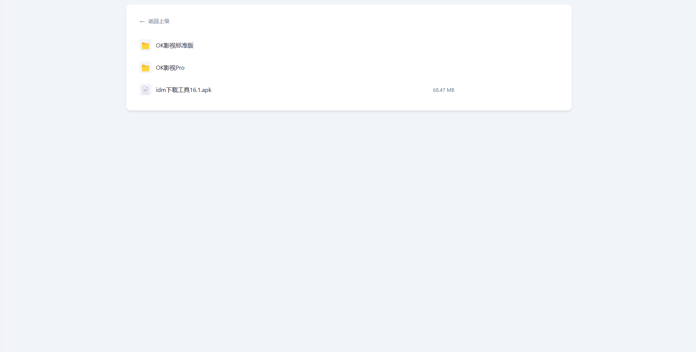
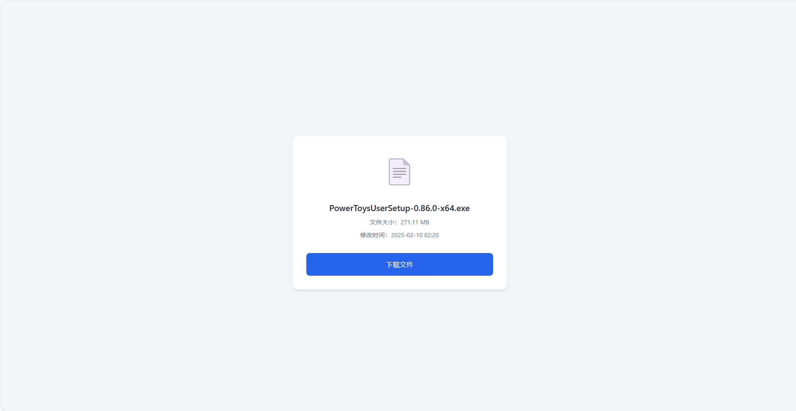
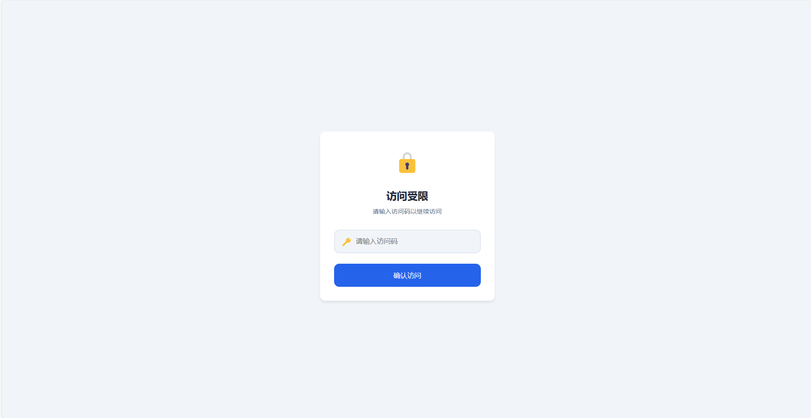
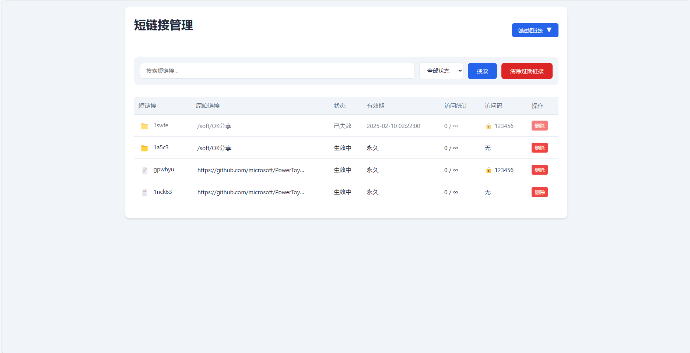

# ShareDL

一个基于 Cloudflare Workers 的文件分享和代理下载服务。支持直接代理下载、生成短链接分享，以及 AList 文件的在线预览。

## 📸 预览

### 文件列表预览


### 文件信息页面


### 访问码验证


### 管理后台



## 🚀 特性

- 支持直接代理任意 HTTP/HTTPS 链接下载
- 支持生成文件/文件夹的短链接分享
- 支持访问次数限制和有效期设置
- 支持访问码保护
- 支持 AList 文件夹的在线预览和分享
- 支持管理后台，可搜索和管理短链接
- 智能的地区访问控制

## 🛠️ 部署步骤

### 1. Workers 配置

1. 在 Cloudflare Workers 中创建新的 Worker
2. 将 `worker.js` 的完整代码复制到 Worker 编辑器中并保存
3. 创建 KV 命名空间
4. 在 Worker 设置中绑定 KV 命名空间为 `URL_KV`
5. 设置环境变量：

```bash
# AList 服务的地址，不要以斜杠结尾
ALIST_API_URL: https://alist.example.com

# AList 的访问令牌，在 AList 管理后台获取
ALIST_TOKEN: alist_token_xxxxxxxxxxxxx

# 管理页面的访问路径，建议设置为随机字符串
ADMIN_PATH: /admin_123456

# 允许访问的地区代码，用逗号分隔，不添加则允许所有地区访问
WHITE_REGIONS: CN,HK

# 直接代理下载的路径前缀，设置为 / 则支持根路径代理，也可以设置为 /proxy/ 等，不添加则禁用此功能
PROXY_PATH: /
```

## 📖 使用方法

### 直接代理下载

根据 `PROXY_PATH` 的配置，支持两种方式：

1. 根路径模式 (`PROXY_PATH='/'`)：
```
https://dl.example.com/https://example.com/file.zip
```

2. 带前缀模式 (`PROXY_PATH='/proxy/'`)：
```
https://dl.example.com/proxy/https://example.com/file.zip
```

### 短链接使用说明

创建短链接时支持两种输入方式：

1. 文件链接：直接输入文件的完整URL地址
```
例如: https://example.com/path/to/file.zip
```

2. 文件夹链接：输入 AList 中的文件夹路径
```
例如: movies/2025 或 /movies/2025
```

### 短链接管理

访问 `/{ADMIN_PATH}` 进入管理界面，支持：

- 创建短链接
  - 支持设置访问次数限制
  - 支持设置有效期
  - 支持设置访问码保护
- 管理短链接
  - 搜索和筛选
  - 修改有效期
  - 修改访问次数限制
  - 修改访问码
  - 删除短链接
- 清理过期链接

## 📄 License

MIT License